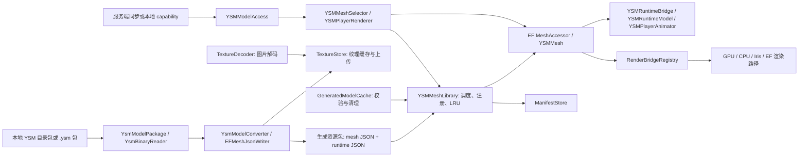
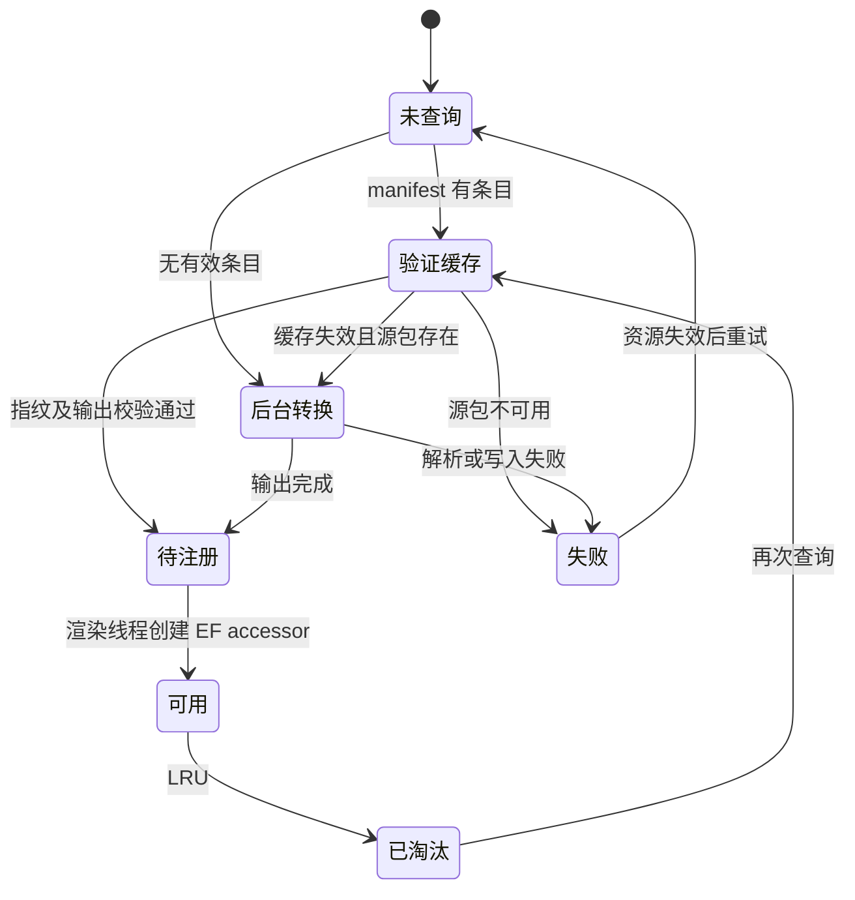

# 架构设计与演进约束

> 基线：2026-10-03 的工作区源码。目标环境为 Minecraft 1.20.1、Forge 47、Epic Fight 20.14.17，以及官方 YSM 2.6.5、OpenYSM、ModernYSM。本文描述**当前实现**和**今后改动必须遵守的约束**；标为“待演进”的内容尚未实现。功能和配置说明见 [README](../README.md)。

## 1. 要守住的行为

1. 战斗模式使用转换后的 YSM 网格和 Epic Fight 动画；非战斗模式由 YSM 自身渲染。YSM 内置的 Steve/Alex 模型走原版双足模型。
2. 没有模型、转换尚未完成、第三方模组接管外观或可选渲染路径不可用时，可以退回既有渲染路径；不能让角色消失、双重绘制或丢失持有物图层。
3. 模型按需加载。首帧查询不做整包解密、输出哈希验证、脚本编译、图片解码或大网格构造；后台完成后再注册。
4. 客户端资源有明确所有者。模型淘汰、资源重载和断线分别清理其各自生命周期的状态，不让旧任务在新一代缓存中发布结果。
5. 输入可能来自模型包、磁盘缓存或服务器。路径、大小、数量和网络字段的边界检查不能因为性能优化而绕过。

这些是扩展新功能时的兼容条件，不是当前所有路径已经由自动测试充分证明的声明。

## 2. 当前组件与数据流

| 边界 | 当前入口和职责 | 不应继续塞入的职责 |
|---|---|---|
| 模组启动及事件 | [`YSMEpicFightCompat`](../src/main/java/com/ysmef/compat/YSMEpicFightCompat.java)、[`YSMCompatClientEvents`](../src/main/java/com/ysmef/compat/event/YSMCompatClientEvents.java)、[`YSMReloadTrigger`](../src/main/java/com/ysmef/compat/event/YSMReloadTrigger.java)：注册配置、网络、资源包、渲染桥与生命周期事件 | 模型解析、GL 细节、持久化格式 |
| 分支与外部 API | [`YsmFork`](../src/main/java/com/ysmef/compat/ysm/YsmFork.java)、`YsmClasses`、`mixin`、`compat`：识别发行形态并隔离 YSM/EF/其他模组的差异 | 将分支判断散落到几何转换、动画规则和着色器中 |
| 输入与转换 | `ysm` 解析包及脚本；[`YSMGeoModel`](../src/main/java/com/ysmef/compat/model/YSMGeoModel.java)、[`EFMeshJsonWriter`](../src/main/java/com/ysmef/compat/model/EFMeshJsonWriter.java)、`YSMJointMapper` 生成 EF 网格及运行时 JSON | 访问客户端实体、网络连接或创建 GL 对象 |
| 模型协调 | [`YSMMeshLibrary`](../src/main/java/com/ysmef/compat/model/YSMMeshLibrary.java)：按模型调度缓存恢复、注册、预热、LRU 与失效；[`YsmModelConverter`](../src/main/java/com/ysmef/compat/model/YsmModelConverter.java) 执行单模型转换并返回结果 | 新增解析格式、脚本语义、纹理解码算法；库仍是集中点，应继续缩小 |
| 资源所有权 | [`ManifestStore`](../src/main/java/com/ysmef/compat/model/ManifestStore.java) 管清单；[`GeneratedModelCache`](../src/main/java/com/ysmef/compat/model/GeneratedModelCache.java) 校验和清理生成产物；[`TextureStore`](../src/main/java/com/ysmef/compat/model/TextureStore.java) 管纹理注册、缓存和上传；[`TextureDecoder`](../src/main/java/com/ysmef/compat/model/TextureDecoder.java) 做 CPU 解码；[`MeshReleaseQueue`](../src/main/java/com/ysmef/compat/model/MeshReleaseQueue.java) 管淘汰网格的延迟释放 | 在其他类中另建同一资源的“第二份真相” |
| 运行时动画 | `model.runtime` 编译脚本、按实体求值、处理骨骼与次级运动；[`AnimatorEvalInputs`](../src/main/java/com/ysmef/compat/model/runtime/AnimatorEvalInputs.java) 捕获求值输入；[`YSMRuntimeBridge`](../src/main/java/com/ysmef/compat/model/runtime/YSMRuntimeBridge.java) 连接绘制上下文 | 解密模型包、修改网络协议、直接拥有纹理管理器 |
| 绘制 | [`YSMMesh`](../src/main/java/com/ysmef/compat/model/YSMMesh.java) 决定路径；`gpu`、`cpu` 实现资源与绘制；[`RenderBridgeRegistry`](../src/main/java/com/ysmef/compat/model/RenderBridgeRegistry.java) 与 `MeshReleaser` 反转依赖 | 从渲染路径回写模型缓存/清单 |
| 模型选择与同步 | `network` 处理握手和广播；[`YSMModelAccess`](../src/main/java/com/ysmef/compat/renderer/YSMModelAccess.java) 解析玩家选择；`renderer` 决定是否接管并保留前一个 renderer | 从网络处理线程直接读写 GL/EF 渲染注册表 |

### 现存依赖例外

包名还不是严格的分层架构：`ysm.YsmModelPackage` 使用 `model.YSMGeoModel`，`model` 与 `model.runtime` 相互引用，运行时桥还读取 `renderer.YSMBattleMode`。因此**不能**仅凭包名声称已经无环。新的跨包依赖应先明确数据和接口所有者；不要再增加反向引用。若拆分包，先移动稳定的数据类型，再移动调用方，保持每一步可编译。当前 `RenderBridgeRegistry`/`MeshReleaser` 已隔开 `model` 对 `gpu`、`cpu` 的直接导入，扩展绘制路径时沿用这一边界。

## 3. 模型状态机与缓存契约

下图是现有多个集合和队列的**概念状态**，不是代码中已经存在的枚举。状态的协调者是 `YSMMeshLibrary`。

- `ensureModel` 只负责查询或提交任务；未就绪时返回 `false`，渲染器使用回退网格。`PENDING_MODELS` 在渲染线程完成 accessor 注册之前保持占用，避免重复提交。
- 后台线程可以读取、校验、解密、解析和写入**模型局部输出**。Epic Fight 的 `Meshes.ACCESSORS` 是非线程安全表，`MeshAccessor.create` 必须由渲染线程在 `drainPendingMeshRegistrations` 中执行。
- 缓存命中需同时满足源模型指纹、生成器键、mesh/runtime JSON 和纹理缓存的校验。`ManifestStore.CACHE_KEY` 由 `MANUAL_VERSION` 与 `model/` 源码内容指纹构成。若改变了该目录**以外**的代码，却改变生成产物的格式或意义，必须调整 `MANUAL_VERSION` 并解释原因。
- 清单懒更新会合并磁盘上本次会话未访问的条目；`replaceAll` 才是明确的全量重建。不要让每个模型的转换覆盖整个清单。
- 资源重载通过 `LOAD_GENERATION` 废弃旧转换与注册任务。运行时预加载另有任务票据与代数；纹理解码/上传另有每纹理 token。新增异步阶段必须携带可验证的代数或身份，不能只靠 `Future.cancel()`。
- `FAILED_MODELS` 是当前失效周期内的失败标记。若添加自动重试，应定义退避、上限、用户可见日志和重载后的复位行为。

## 4. 线程、锁与数据交接

| 执行位置 | 可以做 | 不可以做 |
|---|---|---|
| 客户端渲染/主线程 | EF accessor 注册、mesh 预热、纹理上传/释放、GL 对象创建与销毁、选择网格、读取实时实体状态 | 大文件哈希、包解密、图片解码、批量脚本编译；不要在每帧为同一模型做重复昂贵工作 |
| `LAZY_POOL` 等后台池 | 输入与输出文件 I/O、校验、转换、纹理解码、预编译；提交不可变的结果/任务票据 | 调用 `MeshAccessor.create`、操作 GL/TextureManager、直接访问实时 `LivingEntity` 或渲染状态 |
| `ManifestStore` 后台单写线程 | 懒更新时合并并写清单快照；显式 `generateAll` 使用受同一快照锁保护的同步 `replaceAll` | 执行渲染工作，或依赖一个必须等该写线程完成的渲染线程锁 |
| 网络处理线程 | 校验方向、连接版本和报文边界；用 `context.enqueueWork` 交给相应主线程 | 直接修改客户端世界/渲染注册表；未握手便接受模型选择 |

规则：

1. 后台工作传递 `ModelResult`、不可变输入快照或明确所有权的资源；共享对象必须说明谁发布、谁关闭、何时失效。`AnimatorEvalInputs` 是异步求值的输入边界，新增 Molang query 时先在渲染线程捕获值。
2. `YSMMeshLibrary` 的类锁保护状态转换，不在锁内增加大文件 I/O 或等待后台任务。若新代码同时碰到库锁、运行时模型缓存锁或纹理状态，先画出锁顺序；不能让反向调用形成死锁。
3. 上下文必须成对入栈/出栈。`YSMMeshSelector` 成功选择后设置实体，`YSMMesh.draw` 的 `finally` 清除它；新增提前返回或异常路径也要经过相同清理。
4. 性能预算沿用当前有界处理：网格预热每 tick 约 8 ms，纹理上传每次 drain 约 10 ms。预算是调度边界，不保证任何单个 GL 调用能被中断；新增任务应能分批并可取消/丢弃。

## 5. 资源生命周期与唯一所有者

| 资源 | 创建/持有方 | 释放或复位时机 |
|---|---|---|
| EF mesh accessor、LRU 与待注册队列 | `YSMMeshLibrary` | LRU 淘汰或 `invalidateAll`；旧代任务不得注册 |
| 已淘汰但可能仍被本帧引用的 `YSMMesh` | `MeshReleaseQueue` | 客户端 tick 延迟释放；全量失效时立即清空并销毁 |
| GPU/CPU/Iris 路径的 VBO、SSBO、着色器关联缓存 | 各渲染路径，向 `MeshReleaser` 注册 | 淘汰单 mesh 或全量失效，由渲染线程调用；路径实现负责幂等释放 |
| 纹理原始字节、解码中的 `NativeImage`、上传队列、`DynamicTexture` | `TextureStore` | 模型淘汰、替换或全量失效；解码结果交给队列后由队列/上传方接管，过期 token 必须关闭图像 |
| 编译后的 runtime model、预加载任务 | `YSMRuntimeModel` | 单模型替换、淘汰或全量失效；旧票据不能重新发布 |
| 每玩家动画/物理状态 | `model.runtime` 中各对应缓存 | 玩家长期未用、模型失效或离开世界；新缓存必须有同样的清理入口 |
| 清单文件及内存镜像 | `ManifestStore` | 文件跨会话保存；后台写入须合并版本，不能因模型 LRU 淘汰删除持久条目 |
| 网络同步的玩家选择 | `ModelSyncClient` | 断线清空；**F3+T 不清空**，服务端不一定重发未改变的选择 |

**失效范围必须区分：**模型 LRU 淘汰只释放该模型的内存/GL 状态；F3+T 和 `/ysm model reload` 让模型缓存重新验证；断线清除连接和每玩家状态。不要把三者合成一个“清空所有静态字段”的方法。资源释放需可重复执行，GL/TextureManager 操作留在渲染线程。

## 6. 渲染与兼容策略

- 玩家渲染槽只保留一个 provider。`YSMPlayerRenderer` 保存被替换的 provider，不处理当前玩家时委托给它；`handles` 是无副作用探测，真正的网格选择发生在 `getMeshProvider`。新增外观条件先走 `LookOwners`，避免与其他模组叠绘。
- `YSMRenderHook` 抑制 YSM 自带玩家渲染在战斗模式中的接管，使 EF 使用有持有物图层的原版玩家 renderer。修改事件优先级或取消行为前，必须核对“谁真正绘制”和“谁只取消事件”。
- `YSMMesh.draw` 首先处理 Real Camera 的捕获 buffer（需要向该 buffer 写顶点）；一般场景尝试直接 GPU 路径，再按能力、光影包、模型大小等条件选择 Iris/EF 计算或 CPU 回退。绘制路径的 `tryRender` 返回值表示**是否已经绘制**；返回 `false` 时不得留下半个 GL 状态、已消费的 buffer 或未恢复的 pose/context。
- 分支识别只由 `YsmFork`/`YsmClasses` 给出证据和结果。当前提供的 OpenYSM 源码使用 Forge 事件处理入口；ModernYSM 源码使用返回 `boolean` 的 helper 和 Forge 包装 hook。`OpenYsm*Mixin` 同时容纳两种签名，`YsmUnobf*` 处理两分支共享的可读目标，官方混淆版使用其专属 Mixin。不要按版本号猜分支，也不要为相同目标/签名再注册一组重复 Mixin。
- `require=0` 允许可选目标签名不存在，但方法漂移也可能静默失效。修改外部模组入口时，更新 [`MixinTargetSignatureTest`](../src/test/java/com/ysmef/compat/contract/MixinTargetSignatureTest.java)，用对应源码或实际发行 jar 证明签名，并在游戏内验证事件行为。源码测试验证声明，jar 测试验证字节码；两者不能替代运行时渲染验证。

### 次级运动的职责边界

- `YsmPhysicsParts` 从模型骨骼和网格生成部件；`YsmPhysicsTopology` 只计算链条大小与邻片关系；`YsmPhysicsMotionLimits` 根据部件类型给出整链预算和风阻上限。规则按几何和类型制定，不按单个模型 ID 分支。
- `YsmDynamicBoneSolver` 积分单个摆锤并处理质心与身体碰撞；`YsmPhysicsCoupling` 在邻片间传递相对各自静止姿势的摆动，不平均绝对朝向，否则会抹掉裙摆原有的展开形状；`YsmMeshSecondaryMotion` 编排 EF 姿势、碰撞、耦合、限位和最终网格变换。耦合或限位改变方向后，求解器状态、日志角度及绘制四元数必须指向同一个结果；耦合后要重检身体碰撞。
- 衣物的整条链不能把逐关节最大角度直接相加，否则短裙的三节链可折到 120°。腿部胶囊体不能只因裙摆根点位于腿内便整体跳过；只有静止质心本来就在胶囊体内时才跳过无法满足的碰撞。新增物理规则至少要用真实模型和奔跑输入验证这两项不变量。

## 7. 扩展规则：改哪里、必须同时改什么

| 变更 | 入口 | 必须检查的连带影响 |
|---|---|---|
| 新 YSM 包格式、加密或资源类型 | `ysm` 解析层 | 输入大小/路径防护；目录包和二进制包样例；错误回退；生成输出是否因此变化 |
| 新几何/关节映射 | `YSMGeoModel`、`EFMeshJsonWriter`、`YSMJointMapper`、`JointTable` | mesh/runtime JSON、绑定姿势不变式、EF 关节数限制、缓存键、真实模型 golden 测试 |
| 新动画 query、状态或物理规则 | `YSMRuntimeModel`、`YSMPlayerAnimator`、对应 `YsmPhysics*` | 异步 `AnimatorEvalInputs` 快照、每玩家状态释放、战斗/非战斗语义、确定性测试与真实模型样例 |
| 新渲染路径 | `RenderBridgeRegistry` 接口实现、`MeshReleaser`、客户端 setup 注册 | `tryRender` 返回语义、GL 状态恢复、淘汰/重载释放、Real Camera 与 shader/outline 回退 |
| 新 YSM/EF 分支或 Mixin | `YsmFork`、`mixin`、必要的反射适配器 | 唯一分支证据、源码及发行 jar 签名、`require=0` 静默失败风险、三分支渲染矩阵 |
| 新网络消息/字段 | `network` 与 `message` | 协议版本、握手前拒绝、长度/数量上限、方向、主线程交接、断线清理 |
| 新缓存/静态映射 | 所属组件 | 唯一所有者、键和内存上限、失效触发点、跨世界清理、并发读写说明 |

**代码评审门槛：**新状态必须回答“谁拥有、在哪个线程读写、何时失效、失败时退到哪里”；新跨包调用必须回答“为什么接口应放在被依赖的一侧”；新反射或 Mixin 必须附目标证据和兼容版本。未回答这些问题的实现先补设计说明，不以“以后再整理”放行。

提交说明至少写清：涉及的数据流与所有者、线程交接和取消方式、缓存键/失效影响、失败回退、自动测试结果、尚未做的游戏内组合。新路径不要用空的 `catch` 让失败静默；可以降级，但应有带模型或分支上下文且受限频的诊断。

## 8. 验证与发布前检查

### 自动检查

1. 常规修改运行 `./gradlew test`。转换器或解析器改动补充真实模型/黄金样例，防止只测试自己的实现细节。
2. 改动官方混淆版目标，运行默认的 jar 签名契约。改动 OpenYSM/ModernYSM 目标，用 `-Dysmef.fork=open|modern` 加 `-Dysmef.fork.source=<源码根目录>` 或 `-Dysmef.fork.jar=<发行包>` 运行 `MixinTargetSignatureTest`。完整命令见 README。
3. 改动生成格式时核对 `CACHE_KEY` 变化及旧清单重建行为；改动异步或释放逻辑时测试“任务完成前失效/替换”和重复释放。

### 游戏内最小矩阵

自动测试不能模拟真实 GL、EF 事件顺序和第三方 Mixin 合成。涉及渲染、资源、分支时至少覆盖：

| 维度 | 必看场景 |
|---|---|
| 分支 | 官方 YSM、OpenYSM、ModernYSM；未安装 YSM 时可安全启动 |
| 模型 | 无模型、内置 Steve/Alex、自定义目录包、加密 `.ysm`；首次加载、缓存命中、切换模型 |
| 渲染 | 战斗/非战斗、第三人称/第一人称、持有物和盔甲层、GPU 开关、光影包/CPU 回退、Real Camera 捕获 |
| 生命周期 | LRU 淘汰后重进、F3+T、`/ysm model reload`、快速连续切换、断线重进另一世界 |
| 可选兼容 | EFTLM 女仆、其他模组接管外观时的委托与恢复 |
| 联机 | 有/无本模组的服务器、握手版本不匹配、远端玩家换模和断线重连 |

记录结果时同时保存日志中的 YSM 分支判定、注册的渲染路径、模型 ID 和回退原因。**测试通过只证明所测组合；未运行的分支和 GL 路径须在发布说明中点名。**

## 9. 待演进的拆分顺序

这些是降低未来改动成本的目标，**不是要求立即大规模重写**：

1. **先固定协议，再拆类。** 为模型加载结果、缓存条目、渲染资源句柄建立小而稳定的数据契约；保留 `YSMMeshLibrary` 外部入口，以免同时修改所有调用方。
2. **继续缩小 `YSMMeshLibrary`。** 输出校验与清理已移至 `GeneratedModelCache`，单模型转换与结果类型已移至 `YsmModelConverter`。下一步可提取 LRU 决策；库保留状态机与渲染线程注册。每一步用现有测试/黄金样例锁住行为。
3. **继续拆分 `TextureStore` 的磁盘与 GL 阶段。** 图片解码已移至 `TextureDecoder`；文件布局/缓存与 TextureManager 注册仍在 `TextureStore`。后续拆分须保持 token、`NativeImage` 交接和延迟释放语义。
4. **收紧运行时依赖。** `YSMPlayerAnimator` 的输入捕获已移至 `AnimatorEvalInputs`；下一步把纯求值及 `model.runtime -> renderer` 等现存反向引用逐步改成显式输入。物理规则先按数据与求解器分界，不按模型名称堆例外。
5. **给兼容层留可替换入口。** 分支探测、Mixin 目标、反射 API 和对应测试放在同一改动中；遇到新 fork 先建立证据与失败回退，再接入核心路径。

每一步的完成标准是：调用方不需要知道被抽出的内部状态；缓存失效和释放顺序不变；三类测试（单元、签名契约、必要的游戏内矩阵）有对应结果。不要为了目录整齐而一次性移动所有类。
